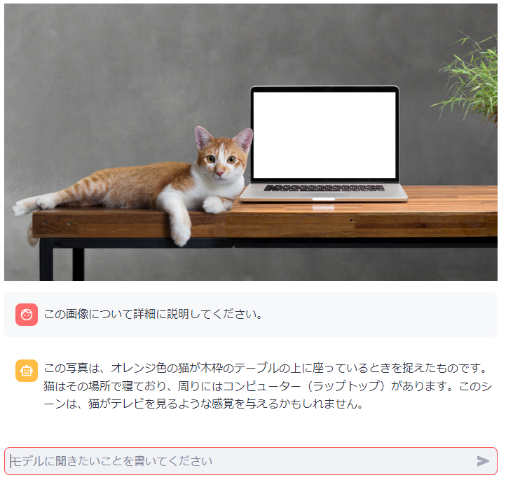
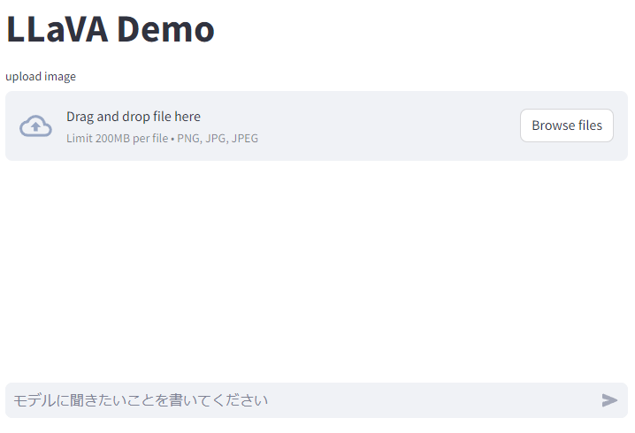

# LLaVA-Python-Sample

Vision and Language Model（画像と自然言語を組み合わせたモデル）に画像の説明をさせるサンプルコード

## Quick Start

```bash
$ make setup
$ docker-compose up -d
```

open http://localhost:8501



画像は https://huggingface.co/rinna/bilingual-gpt-neox-4b-minigpt4/resolve/main/sample.jpg より

## Usage

1. 画像をアップロードする
1. チャット欄にモデルへのプロンプトを記述する



## Used Model

https://github.com/abetlen/llama-cpp-python?tab=readme-ov-file#multi-modal-models
にあるようにいくつかのモデルから好みのものを選択して使うことができる。

`setup.sh` や `app.py` を適宜書き換えれば別のモデルで試すこともできる。
